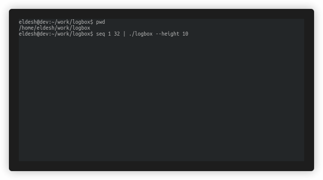

# logbox

logbox is a lightweight tail-style TUI wrapper for command output and stdin streams. It gives you a live FOLLOW/SCROLL view, scrollback history, tee output, signal forwarding, and a plain passthrough mode to make log inspection and troubleshooting faster without a full terminal multiplexer. By continuously redrawing a reserved region, it helps you inspect very long logs without flooding normal terminal scrollback/history.

## What Is logbox

logbox runs any line-oriented command and redraws only a reserved region in your terminal, similar to docker build progress output. It is designed for fast, focused log observation during builds, tests, and troubleshooting sessions.

## Key Features

- Tail-style live rendering in TTY mode.
- FOLLOW and SCROLL modes.
- Configurable live view height with bounded scrollback history.
- stdin support: `producer | logbox`.
- `--tee` output to file, with optional append mode.
- `--plain` mode for CI/non-TTY or simple passthrough.
- Signal forwarding to child process (`Ctrl-C`, `SIGTERM`, `Ctrl-\`).
- Child process exit code is preserved.

## Installation

### Install the binary directly

```bash
make install
```

This runs `go install` and installs the binary to your Go bin directory (`$GOBIN` or `$HOME/go/bin` by default).

### Install via Debian package

First, build packages:

```bash
make deb
```

Then install one package for your architecture:

For amd64:

```bash
apt-get install ./dist/logbox_0.1.0_amd64.deb
```

For armhf:

```bash
apt-get install ./dist/logbox_0.1.0_armhf.deb
```

For arm64:

```bash
apt-get install ./dist/logbox_0.1.0_arm64.deb
```

## Quick Start

Run a command via logbox:

```bash
logbox --height 10 -- make test
```

Or read from stdin:

```bash
seq 1 100 | logbox --height 12
```

Demo capture generated with terminalizer (shows that lines printed before starting logbox remain visible while only the reserved log region updates):



## Usage

```text
logbox [flags] -- <command> [args...]
producer | logbox [flags]
```

Flags:

- `--height N`: Live view height (status line + visible logs). Default is auto (about one third of terminal height, min 5, max 30).
- `--history N`: Scrollback size in lines for TUI mode. Default `1000`. Must be `>= --height`.
- `--clear`: Clear the reserved live region on exit.
- `--plain`: Disable TUI redraw and pass logs through.
- `--tee FILE`: Also write output to a file.
- `--append`: Append to `--tee` file instead of truncating.

## TUI Modes And Key Bindings

Modes:

- FOLLOW: Tail-follow the newest lines.
- SCROLL: Manual navigation over history.

Key bindings:

- `k` / `Up`: Scroll up one line (switches to SCROLL).
- `j` / `Down`: Scroll down one line.
- `u` / `PageUp`: Scroll up one page.
- `d` / `PageDown`: Scroll down one page.
- `g`: Jump to top of buffer.
- `G`: Jump to bottom of buffer.
- `f`: Return to FOLLOW mode.
- `q` / `Enter`: Quit when process has already finished in SCROLL mode.

## Signal Handling

- `Ctrl-C` sends `SIGINT` to the wrapped command while it is running.
- `Ctrl-\` sends `SIGQUIT` to the wrapped command while it is running.
- `SIGTERM` is forwarded to the wrapped command.

## Examples

```bash
logbox --height 10 -- make test
```

```bash
logbox --height 10 --history 2000 -- make test
```

```bash
logbox --height 14 --history 12000 -- bash -lc 'make lint && make test && make build'
```

```bash
logbox --tee build.log --append -- docker build --progress=plain .
```

```bash
cat app.log | logbox --plain --tee out.log
```

## Build

Build for the current OS/architecture and generate a local `logbox` binary in the repository root.

```bash
make build
```

### Cross Build

Cross-build Linux binaries and `.deb` packages for multiple architectures.

Cross-build Linux binaries:

```bash
make bin
```

`bin` is an aggregate target that depends on all `bin-*` targets above, so it builds every listed Linux binary output in one run.

Targets:

- `bin-amd64`
- `bin-armv6`
- `bin-armv7`
- `bin-arm64`

Output artifact paths:

- `dist/logbox-linux-amd64`
- `dist/logbox-linux-armv6`
- `dist/logbox-linux-armv7`
- `dist/logbox-linux-arm64`

Build `.deb` packages:

```bash
make deb
```

`deb` is an aggregate target that depends on all `deb-*` targets above, so it builds every listed package output in one run.

Package targets:

- `deb-amd64`
- `deb-armhf` (uses armv6 binary)
- `deb-arm64`

Output package paths:

- `dist/logbox_<version>_amd64.deb`
- `dist/logbox_<version>_armhf.deb` (uses armv6 binary)
- `dist/logbox_<version>_arm64.deb`

## Man Page

Generate man page:

```bash
make man
```

Install man page:

```bash
make install-man
```

## Exit Behavior

- FOLLOW mode: logbox exits immediately after the wrapped process ends.
- SCROLL mode: logbox keeps the view open for review.
	- Press `q` or `Enter` to quit.
	- Press `f` to jump to the end and quit.
- With `--clear`, logbox clears the reserved live region before returning.

## Limitations / Notes

- Best for line-oriented log output.
- Not intended for full-screen TUI/curses applications.
- Commands that rely heavily on ANSI cursor movement or `\r` progress updates may not render as intended.
- In non-TTY environments, use `--plain` behavior (or it is selected automatically when appropriate).
- Exact stdout/stderr interleaving is not guaranteed when streams are read concurrently.

## License

MIT License. See `LICENSE`.